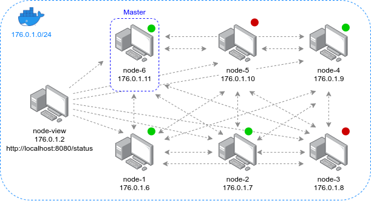
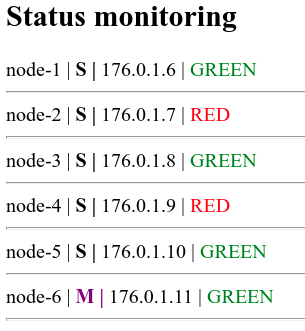
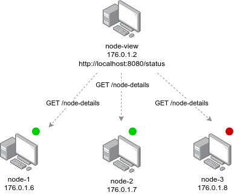
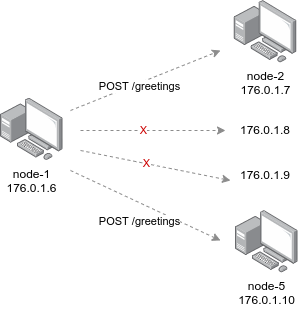

# Distributed master node selection in a cluster
 
This project implements a **selection of a single master node** out of *N* nodes connected to a computer network. This problem was tackled using so-called **election algorithm** where every node can send a message to every other node.
 
The purpose of the master is to assign each node a color (red or green), so the ration of 1/3 red and 2/3 green is satisfied. The master itself is always colored green. When a node is not responding to the master, it is considered to be down and the master recolors the remaining nodes accordingly if needed. When the master node goes offline, the process of selecting a new one starts again.



## Running the application

### Requirements

In order to get the whole project up and running, the user is required to have [Vagrant](https://www.vagrantup.com/) and [Docker](https://www.docker.com/) installed on their machine.

### Starting the application

Once the user has installed all the requirements, all they have to do is to navigate to the root folder of the project directory where the Vagrant file is located and run the following command.

```
vagrant up
```

This will automatically start all the containers that make up the project. It has been configured that the containers are built concurrently, meaning that the order in which they start up is not guaranteed and may differ with each start of the application. If you find this undesirable, you can turn the parallelism off by uncommenting line 4 in the Vagrant file.

```
#ENV['VAGRANT_NO_PARALLEL'] = "1"
```

**WARNING**: If you encounter any errors, try to terminate the process using `CTR+C` and running the `vagrant up` command again.

The user can verify that all nodes are up and running using the `docker ps` commands which lists out running containers.

#### Changing up the number of nodes

If the user wants to start the application with fewer or more nodes, they can do it by changing the following variable in the Vagrant file (line 31).

```
NODES_COUNT = 6
```

### Clean up

Once the user is done testing the application, they can clean everything up using the following command.

```
vagrant destroy -f
```

This will stop all the running containers this application consists of.

## Structure of the project

Alongside the *N* nodes running on the network, there is also an extra node which helps visualize the state of individual nodes; their color and who is the master. It knows the ip addresses of the nodes as they were added into its configuration when creating a docker image (using Vagrant). The current state of all the nodes can be seen at http://localhost:8080/status.



The table columns represent the hostname, role (master/slave), ip address, and color. The master node is represented as a purple M. If there is a gray color assigned to a node, it means that it is in the process of scanning the network. Once the master is found, the node will be assigned its corresponding color.

## Interacting with the application

The user can test the functionality of the system by shutting off some of the nodes and observing the system recovery. To halt a particular node, the user can use the following command.

```
vagrant halt node-6
```

To start the node up again, the following command can be used.

```
vagrant up node-6
```

## Implementation details

### View node

The view node works as an observer of the state of all the other nodes. Each node has a public API `/node-details` which returns information regarding the node's current state. The results are then aggregated and presented to the user as a simple table that can bee accessed via http://localhost:8080/status.



### Regular node

#### When a node starts up

When a node starts up, it will first start scanning the network looking for other nodes that might already be up and running. It is done by going over the entire range of ip addresses one by one. For each an every ip address, it attempts to call the `\greetings` API, which the nodes use to announce themselves. If another node is found, its ip address is stored into a list of known nodes on the network. It also fetches information on whether the node that was just discovered happens to be the master. Only one master is allowed to be on the network at all times. 



At the end of the scan, there can be three different outcomes. If no other nodes have been discovered, the node becomes the master. If a master was discovered during the process of scanning the network, it will start performing a health check on it (ping). If there are other nodes on the network but none of them is the master, it will engage the process of master election.

**NOTE**: In order to speed up the process of scanning the network, the maximum number of ip addresses allowed to be scanned was reduces to 20 (starting from 176.0.1.1). This constrain can be modified in `app/python/election.py` on line 11.

#### Electing a new master

As mentioned previously, the nodes perform a regular ping on the master node. If a node finds out that the master node is not responding, it will start off the master election process.

Usually, each node has a unique number which is considered to be its ID. In this implementation, the ID was substituted by the node's ip address (the higher the ip address, the higher the priority).

When a node find out that the master is offline, it sends an election message (`POST /election`) to all its known nodes which have a higher ip address. If there are no other nodes with a higher ip address, the node itself becomes the new master and lets all its known nodes know about it through `POST /master-announcement`. If the node has sent an election message to all the other nodes that it was supposed to, it will await the new master announcement. 

If a node receives an election message, it checks whether the node itself is not the new master and whether it has already sent an election message to all the other nodes. If none of this is true, it sends an election message to all its known nodes that happen to be assigned a higher ip address. If the nodes has already done its job, the election message will be discarded.

#### Assigning colors to nodes